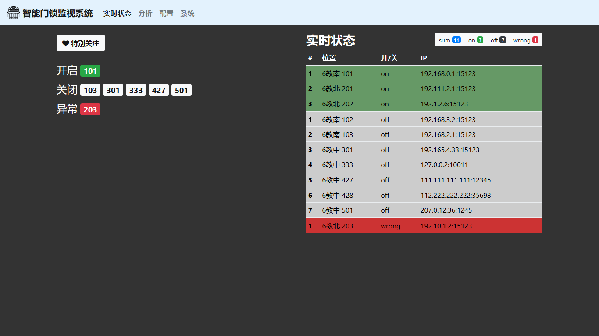

# Key Cloud

**Key Cloud** is a smart doors' lock management cloud platform.

* [Download Key Cloud source code here](https://github.com/estrm/key-cloud)

## Feature

* tiny and super quick

## Build

Build with **CMake**.

1. mkdir build
2. cd build
3. cmake ..
4. make
5. cd ../bin/
6. ./sam
7. visit local IP: **127.0.0.1:8888** (or other ports defined by variable **s_http_port** in **server.cc** file)

## Display

## Third Party Library

1. [mongoose-6.9](https://github.com/cesanta/mongoose/tree/6.9) GPL-V2 License
2. [jsoncpp-1.8.3](https://github.com/open-source-parsers/jsoncpp/tree/1.8.3) MIT License

## Contributors

* [guguant](https://github.com/estrm)
